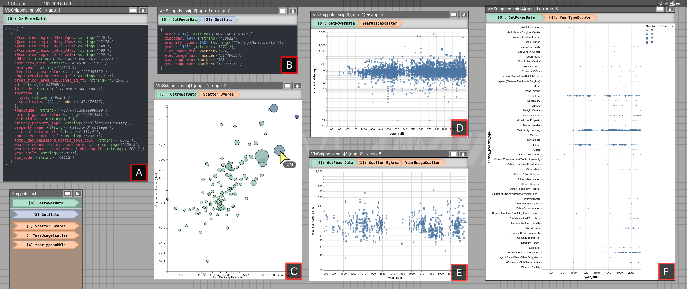

# Power Consumption Data Exploration

> **An exploratory analysis of Chicago Energy Benchmarking data.** [A] The initial dataset when fetched from the Chicago Data Portal API.  [B] Additional summary information produced through processing the data further, yielding unique or min and max values for attributes in the initial dataset. [C] A custom D3 bubble chart plotting mean electricity vs mean natural gas usage per community area. The bubble size and color represent the number of buildings and their average square footage, respectively. Additionally, this view is interactive --- a selected bubble will produce a dataset of buildings within that community area. [D, E] Vega-Lite scatterplots which encode the energy usage per square foot by year, where [D] shows all buildings and [E] shows buildings from the community area selected in [C]. Note that a single snippet is used to create both [D] and [E], and is used twice in the branching pipeline to support *comparison*. [F] A Vega-Lite bubble chart encoding the number of buildings constructed per year by property type.

<!-- ## Files -->