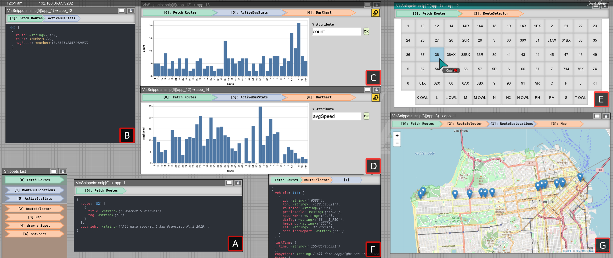

# Power Consumption Data Exploration

> **An interactive transportation dashboard for SF Muni bus data.** \[A\] The list of all bus routes fetched from the NextBus API. \[B\] A per-route summary of the number of busses and their average speed for all routes from *A*. This summary periodically retrieves new information every 15s. \[C, D\] Vega-Lite bar charts plotting an interactively specified Y-attribute against bus route. The same snippet is used for *C* and *D*, allowing users to enter the desired attribute through the text input. \[E\] A route selector interface built in HTML, populated by all routes from *A}. This interactive view produces an object with details of the selected route. \[F\] Vehicle locations for all busses, fetched using information provided form the selected route in *E*. These locations for the selected route are retrieved and update periodically every 5s. \[G\] A Leaflet map plotting the current location of all busses for the selected route retrieved in *F*.

<!-- ## Files -->